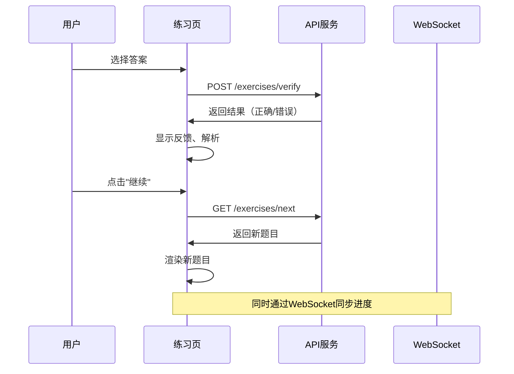

# 多Agent智能教育系统 - 前端规划文档

## 文档版本
- **版本**: v1.0
- **日期**: 2026-05-17
- **后端分支**: my-dev-branch

---

## 一、产品定位与用户画像

### 1.1 产品定位
**智能个性化学习平台** - 基于AI的自适应数学学习系统，通过多Agent架构实现个性化教学。

### 1.2 核心价值
- **个性化**：根据学生掌握度动态调整难度和内容
- **高效**：SM-2间隔重复算法，科学复习记忆
- **直观**：知识图谱可视化，清晰展示学习路径
- **激励**：目标-任务系统，激发学习动力

### 1.3 用户画像
| 角色 | 年龄 | 需求 |
|------|------|------|
| **初中学生** | 12-15岁 | 自学数学、查漏补缺、高效复习 |
| **家长** | 30-45岁 | 查看学习进度、了解薄弱环节 |
| **教师** | 25-55岁 | 分析班级学情、针对性辅导 |

---

## 二、核心页面设计

### 2.1 页面架构

```
┌─────────────────────────────────────────────────────────────────┐
│  首页 (Home)                                                    │
│  └─ 课程列表 + 学习概览                                         │
├─────────────────────────────────────────────────────────────────┤
│  学习中心 (Learning Center)                                     │
│  ├─ 课程详情页 (Course Detail)                                  │
│  ├─ 知识图谱页 (Knowledge Graph)                                │
│  └─ 练习页 (Practice)                                           │
├─────────────────────────────────────────────────────────────────┤
│  错题本 (Mistake Book)                                          │
│  ├─ 错题列表                                                    │
│  └─ 错题详情                                                    │
├─────────────────────────────────────────────────────────────────┤
│  目标与任务 (Goals & Tasks)                                     │
│  ├─ 目标列表                                                    │
│  └─ 任务看板                                                    │
├─────────────────────────────────────────────────────────────────┤
│  学习进度 (Progress)                                            │
│  ├─ 整体进度                                                    │
│  ├─ 课程进度                                                    │
│  └─ 掌握度热力图                                                │
└─────────────────────────────────────────────────────────────────┘
```

### 2.2 详细页面设计

---

#### 页面 1：首页 (Home)

**用户目标**：快速概览学习情况，继续上次学习。

**页面布局**：
```
┌─────────────────────────────────────────────────────────┐
│  [Logo]  多Agent智能学习系统  [侧边栏]  [消息]  [用户]  │
├─────────────────────────────────────────────────────────┤
│                                                         │
│  ┌─────────────────────────────────────────────────┐  │
│  │  🎓 学习概览                                    │  │
│  ├─────────────────────────────────────────────────┤  │
│  │  总进度: ■■■■■■□□□□ 62%                        │  │
│  │  今日学习: 25分钟                                │  │
│  │  错题待解决: 8题                                │  │
│  └─────────────────────────────────────────────────┘  │
│                                                         │
│  ┌─────────────────────────────────────────────────┐  │
│  │  📚 继续学习                                     │  │
│  ├─────────────────────────────────────────────────┤  │
│  │  [卡片: 七年级数学上册]                        │  │
│  │        ■■■■■■■□□□ 70%                         │  │
│  │        [继续学习] 按钮                          │  │
│  └─────────────────────────────────────────────────┘  │
│                                                         │
│  ┌─────────────────────────────────────────────────┐  │
│  │  ⏰ 待复习                                       │  │
│  ├─────────────────────────────────────────────────┤  │
│  │  [知识点: 有理数]  [复习]                        │  │
│  │  [知识点: 绝对值]  [复习]                        │  │
│  └─────────────────────────────────────────────────┘  │
│                                                         │
└─────────────────────────────────────────────────────────┘
```

**交互逻辑**：
- 点击"继续学习" → 进入课程详情页，恢复上次进度
- 点击"复习" → 进入练习页，推送复习题
- 侧边栏快速导航各模块

**API调用**：
```
GET /api/v1/learners/{learner_id}/progress
GET /api/v1/courses
```

---

#### 页面 2：课程详情页 (Course Detail)

**用户目标**：了解课程结构，选择学习内容。

**页面布局**：
```
┌─────────────────────────────────────────────────────────┐
│  < 返回首页  [课程封面图]  七年级数学上册               │
├─────────────────────────────────────────────────────────┤
│  ┌─────────────────────────────────────────────────┐  │
│  │  课程概述                                       │  │
│  │  总进度: ■■■■■■■□□□ 70%  [知识图谱] 按钮       │  │
│  └─────────────────────────────────────────────────┘  │
│                                                         │
│  ┌─────────────────────────────────────────────────┐  │
│  │  📁 课程目录 (可折叠)                             │  │
│  ├─────────────────────────────────────────────────┤  │
│  │  ▼ 第一章 有理数  ■■■■■■■■□□ 85%                 │  │
│  │    ├── ■ 正数和负数 (已掌握)  [学习]             │  │
│  │    ├── ■ 有理数 (已掌握)  [学习]                 │  │
│  │    └── □ 绝对值 (未掌握)  [学习]                 │  │
│  │                                                      │  │
│  │  ▶ 第二章 整式的加减  ■■□□□□□□□□ 20%                │  │
│  │  ▶ 第三章 一元一次方程  □□□□□□□□□□ 0%              │  │
│  └─────────────────────────────────────────────────┘  │
│                                                         │
└─────────────────────────────────────────────────────────┘
```

**交互逻辑**：
- 点击"知识图谱" → 进入知识图谱页
- 点击章节 → 展开/折叠知识点列表
- 点击"学习" → 进入练习页，推送该知识点的题目

**API调用**：
```
GET /api/v1/courses/{course_id}
GET /api/v1/courses/{course_id}/catalog
GET /api/v1/learners/{learner_id}/progress/courses/{course_id}
```

---

#### 页面 3：知识图谱页 (Knowledge Graph)

**用户目标**：直观理解知识点之间的依赖关系。

**页面布局**：
```
┌─────────────────────────────────────────────────────────┐
│  < 返回课程  [缩放] [重置视图]                          │
├─────────────────────────────────────────────────────────┤
│                                                         │
│  ┌─────────────────────────────────────────────────┐  │
│  │  知识图谱可视化 (Canvas/SVG)                      │  │
│  │  [绿色节点: 已掌握]  [黄色节点: 进行中]           │  │
│  │  [红色节点: 未学习]  [连接线: 前置依赖]           │  │
│  │                                                    │  │
│  │                  ┌─────────┐                      │  │
│  │                  │  整数   │ (已掌握)            │  │
│  │                  └────┬────┘                      │  │
│  │                       │                           │  │
│  │          ┌────────────┴────────────┐             │  │
│  │          │                         │             │  │
│  │     ┌────▼────┐              ┌─────▼─────┐        │  │
│  │     │ 正数负数 │ (已掌握)     │  分数    │ (进行中)│  │
│  │     └────┬────┘              └─────┬─────┘        │  │
│  │          │                         │             │  │
│  │          └──────────┬──────────────┘             │  │
│  │                     │                            │  │
│  │              ┌──────▼──────┐                      │  │
│  │              │  有理数    │ (已掌握)              │  │
│  │              └─────────────┘                      │  │
│  └─────────────────────────────────────────────────┘  │
│                                                         │
│  [点击节点查看详情]  [从选中节点开始学习] 按钮         │
│                                                         │
└─────────────────────────────────────────────────────────┘
```

**交互逻辑**：
- 拖拽平移、滚轮缩放
- 点击节点 → 显示详情，显示"开始学习"按钮
- 节点颜色编码掌握状态：绿色=已掌握，黄色=进行中，红色=未学习

**API调用**：
```
GET /api/v1/courses/{course_id}/knowledge-graph
```

---

#### 页面 4：练习页 (Practice) - 核心交互页面

**用户目标**：完成练习题，获得实时反馈。

**页面布局**：
```
┌─────────────────────────────────────────────────────────┐
│  < 返回课程  [当前知识点: 有理数]                        │
├─────────────────────────────────────────────────────────┤
│                                                         │
│  ┌─────────────────────────────────────────────────┐  │
│  │  📝 练习题 (进度: 第 3 题 / 共 5 题)             │  │
│  ├─────────────────────────────────────────────────┤  │
│  │  E003 - 难度: ★★                                │  │
│  │                                                    │  │
│  │  下列说法正确的是？                              │  │
│  │  [A] 0是正数         [B] 0是负数                 │  │
│  │  [C] 0既不是正数也不是负数 [D] 以上都不对       │  │
│  │                                                    │  │
│  │  [💡 提示] (3次机会)  [提交答案] 按钮            │  │
│  └─────────────────────────────────────────────────┘  │
│                                                         │
│  ┌─────────────────────────────────────────────────┐  │
│  │  📈 学习反馈 (答题后显示)                          │  │
│  ├─────────────────────────────────────────────────┤  │
│  │  ✓ 正确！掌握度已提升至 78%                     │  │
│  │  或                                                  │  │
│  │  ✗ 错误！正确答案是 C                             │  │
│  │  解析：0既不是正数也不是负数，而是中性数         │  │
│  │  [查看解析]  [再练一题]  [继续]                   │  │
│  └─────────────────────────────────────────────────┘  │
│                                                         │
└─────────────────────────────────────────────────────────┘
```

**交互逻辑**：
- 用户选择答案 → 点击"提交答案"
- 显示结果反馈（正确/错误+解析）
- 点击"提示" → 显示分级提示（最多3次）
- 点击"继续" → 下一题
- 实时同步进度（通过WebSocket）

**API调用**：
```
GET /api/v1/courses/{course_id}/exercises/next
POST /api/v1/exercises/verify
WS /ws/{learner_id}
```

---

#### 页面 5：错题本 (Mistake Book)

**用户目标**：查看错题、筛选、标记解决。

**页面布局**：
```
┌─────────────────────────────────────────────────────────┐
│  < 返回首页  [筛选器: 课程/章节/知识点/解决状态]  [统计] │
├─────────────────────────────────────────────────────────┤
│                                                         │
│  ┌─────────────────────────────────────────────────┐  │
│  │  📊 错题统计                                    │  │
│  ├─────────────────────────────────────────────────┤  │
│  │  总错题: 15题  已解决: 8题  待解决: 7题        │  │
│  │  [薄弱点TOP3: 绝对值(5题)、正数负数(4题)...]    │  │
│  └─────────────────────────────────────────────────┘  │
│                                                         │
│  ┌─────────────────────────────────────────────────┐  │
│  │  📋 错题列表 (分页)                              │  │
│  ├─────────────────────────────────────────────────┤  │
│  │  [E005] |-5| = ? - 知识点: 绝对值                │  │
│  │         错误 2次 (最近: 5月16日) [查看] [解决]   │  │
│  │                                                    │  │
│  │  [E008] 有理数乘法 - 知识点: 有理数                │  │
│  │         错误 1次 (最近: 5月15日) [查看] [解决]   │  │
│  │                                                    │  │
│  │  [上一页]  1 / 2  [下一页]                       │  │
│  └─────────────────────────────────────────────────┘  │
│                                                         │
└─────────────────────────────────────────────────────────┘
```

**交互逻辑**：
- 筛选器点击 → 动态更新列表
- 点击"查看" → 弹出错题详情模态框
- 点击"解决" → 标记为已解决
- 分页或无限滚动加载

**API调用**：
```
GET /api/v1/learners/{learner_id}/mistakes
GET /api/v1/learners/{learner_id}/mistakes/{mistake_id}
POST /api/v1/learners/{learner_id}/mistakes/{mistake_id}/resolve
GET /api/v1/learners/{learner_id}/mistakes/statistics
```

---

#### 页面 6：目标与任务 (Goals & Tasks)

**用户目标**：设置学习目标，管理任务。

**页面布局**：
```
┌─────────────────────────────────────────────────────────┐
│  < 返回首页  [+ 新建目标]  [查看统计]                     │
├─────────────────────────────────────────────────────────┤
│                                                         │
│  ┌─────────────────────────────────────────────────┐  │
│  │  🎯 我的目标 (Tabs: 进行中 / 已完成 / 已取消)    │  │
│  ├─────────────────────────────────────────────────┤  │
│  │  [卡片: 本周掌握第一章]                         │  │
│  │        ■■■■■■■■□□ 80%                          │  │
│  │        截止: 5月24日 (剩余7天)  [编辑] [完成]   │  │
│  │        ┌───────────────────────────────────┐   │  │
│  │        │任务: 完成正数和负数 ✓             │   │  │
│  │        │任务: 完成有理数 ✓                │   │  │
│  │        │任务: 完成绝对值 ○                │   │  │
│  │        └───────────────────────────────────┘   │  │
│  │                                                    │  │
│  │  [卡片: 期中考试90分以上] (已完成) ✓              │  │
│  └─────────────────────────────────────────────────┘  │
│                                                         │
│  ┌─────────────────────────────────────────────────┐  │
│  │  📋 任务看板 (Kanban)                            │  │
│  ├─────────────────────────────────────────────────┤  │
│  │  ┌─────────┐  ┌─────────┐  ┌─────────┐         │  │
│  │  │ 待办   │  │ 进行中 │  │ 已完成 │         │  │
│  │  ├─────────┤  ├─────────┤  ├─────────┤         │  │
│  │  │ 任务A  │  │ 任务B  │  │ 任务C  │         │  │
│  │  │ 任务D  │  │        │  │ 任务E  │         │  │
│  │  └─────────┘  └─────────┘  └─────────┘         │  │
│  └─────────────────────────────────────────────────┘  │
│                                                         │
└─────────────────────────────────────────────────────────┘
```

**交互逻辑**：
- 点击"+ 新建目标" → 弹出创建目标表单
- 任务拖拽 → 从"待办"到"进行中"到"已完成"
- 点击目标卡片 → 查看详情、编辑、完成

**API调用**：
```
GET /api/v1/learners/{learner_id}/goals
POST /api/v1/learners/{learner_id}/goals
PUT /api/v1/learners/{learner_id}/goals/{goal_id}
POST /api/v1/learners/{learner_id}/goals/{goal_id}/complete
GET /api/v1/learners/{learner_id}/tasks
POST /api/v1/learners/{learner_id}/tasks
POST /api/v1/learners/{learner_id}/tasks/{task_id}/complete
```

---

#### 页面 7：学习进度 (Progress Dashboard)

**用户目标**：全面了解学习情况，分析薄弱点。

**页面布局**：
```
┌─────────────────────────────────────────────────────────┐
│  < 返回首页  [时间范围: 本周/本月/全部]                  │
├─────────────────────────────────────────────────────────┤
│                                                         │
│  ┌─────────────────────────────────────────────────┐  │
│  │  📈 整体进度仪表盘                                │  │
│  ├─────────────────────────────────────────────────┤  │
│  │  总进度: ■■■■■■□□□□ 62%                          │  │
│  │  学习时长: 累计12.5小时                          │  │
│  │  正确率: 78%                                     │  │
│  └─────────────────────────────────────────────────┘  │
│                                                         │
│  ┌─────────────────────────────────────────────────┐  │
│  │  📊 课程进度分布                                  │  │
│  ├─────────────────────────────────────────────────┤  │
│  │  [柱状图: 各课程进度]                           │  │
│  │                                                    │  │
│  │  七年级数学上册: ■■■■■■■□□□ 70%                  │  │
│  │  七年级数学下册: ■■■□□□□□□□ 30%                  │  │
│  └─────────────────────────────────────────────────┘  │
│                                                         │
│  ┌─────────────────────────────────────────────────┐  │
│  │  🔥 掌握度热力图                                │  │
│  ├─────────────────────────────────────────────────┤  │
│  │  [表格: 章节×知识点，颜色深浅表示掌握度]        │  │
│  │  (绿色=高掌握度，红色=低掌握度)                 │  │
│  └─────────────────────────────────────────────────┘  │
│                                                         │
└─────────────────────────────────────────────────────────┘
```

**交互逻辑**：
- 点击时间范围 → 更新数据
- 点击课程进度条 → 进入课程详情页
- 点击热力图单元格 → 查看该知识点详情

**API调用**：
```
GET /api/v1/learners/{learner_id}/progress
```

---

## 三、技术栈推荐

### 3.1 核心框架

| 选项 | 推荐选择 | 理由 |
|------|----------|------|
| **框架** | React 18+ 或 Vue 3+ | 生态成熟，社区活跃 |
| **状态管理** | Redux Toolkit 或 Pinia | 集中式状态管理，调试友好 |
| **路由** | React Router 6 或 Vue Router | 官方推荐，完善的路由功能 |
| **HTTP客户端** | Axios | 支持Promise，拦截器强大 |
| **WebSocket** | Socket.io-client 或原生 WebSocket | 实时通信支持 |

### 3.2 UI组件库

| 选项 | 推荐选择 |
|------|----------|
| **React** | Ant Design / Material UI |
| **Vue** | Element Plus / Naive UI |

### 3.3 可视化库

| 用途 | 推荐选择 |
|------|----------|
| **图表** | ECharts / Recharts |
| **知识图谱** | D3.js / AntV G6 / ReactFlow |
| **进度展示** | 自定义组件 / UI库自带组件 |

### 3.4 工具链

| 工具 | 推荐 |
|------|------|
| **构建工具** | Vite |
| **代码规范** | ESLint + Prettier |
| **TypeScript** | 推荐开启 |
| **测试** | Vitest + React Testing Library |

---

## 四、项目结构

### 4.1 React架构（推荐）

```
src/
├── assets/                  # 静态资源
│   ├── images/
│   └── icons/
├── components/              # 通用组件
│   ├── layout/
│   │   ├── Sidebar.tsx
│   │   ├── Header.tsx
│   │   └── AppLayout.tsx
│   ├── course/
│   │   ├── CourseCard.tsx
│   │   ├── ChapterTree.tsx
│   │   └── KnowledgeGraph.tsx
│   ├── exercise/
│   │   ├── ExerciseCard.tsx
│   │   ├── AnswerFeedback.tsx
│   │   └── HintDisplay.tsx
│   ├── progress/
│   │   ├── ProgressBar.tsx
│   │   ├── MasteryHeatmap.tsx
│   │   └── StatsCards.tsx
│   ├── mistake/
│   │   ├── MistakeList.tsx
│   │   ├── MistakeDetail.tsx
│   │   └── MistakeFilters.tsx
│   └── goal/
│       ├── GoalCard.tsx
│       ├── TaskBoard.tsx
│       └── GoalForm.tsx
├── hooks/                   # 自定义 Hooks
│   ├── useWebSocket.ts
│   ├── useProgress.ts
│   └── useCourse.ts
├── pages/                   # 页面组件
│   ├── Home.tsx
│   ├── CourseDetail.tsx
│   ├── KnowledgeGraph.tsx
│   ├── Practice.tsx
│   ├── MistakeBook.tsx
│   ├── GoalsTasks.tsx
│   └── ProgressDashboard.tsx
├── services/                # API 服务
│   ├── api.ts               # Axios 配置
│   ├── courseApi.ts
│   ├── exerciseApi.ts
│   ├── progressApi.ts
│   ├── mistakeApi.ts
│   └── goalTaskApi.ts
├── store/                   # 状态管理 (Redux Toolkit)
│   ├── index.ts
│   ├── slices/
│   │   ├── userSlice.ts
│   │   ├── progressSlice.ts
│   │   ├── courseSlice.ts
│   │   ├── mistakeSlice.ts
│   │   └── goalSlice.ts
│   └── middleware/
│       └── wsMiddleware.ts
├── types/                   # TypeScript 类型定义
│   ├── course.ts
│   ├── exercise.ts
│   ├── progress.ts
│   ├── mistake.ts
│   └── goal.ts
├── utils/                   # 工具函数
│   ├── formatters.ts
│   ├── validators.ts
│   └── constants.ts
├── App.tsx
├── main.tsx
└── router.tsx
```

### 4.2 Vue架构（备选）

```
src/
├── assets/
├── components/
├── composables/            # 组合式函数
├── pages/
├── router/
├── stores/                # Pinia 状态
├── services/
├── types/
├── utils/
├── App.vue
└── main.ts
```

---

## 五、状态管理设计（Redux 示例）

### 5.1 Store 结构

```javascript
{
  user: {
    id: 'learner_001',
    currentCourseId: 'course_001',
    settings: {}
  },
  course: {
    list: [],         // 所有课程
    current: null,    // 当前课程详情
    catalog: null,    // 课程目录
    knowledgeGraph: null
  },
  exercise: {
    current: null,    // 当前题目
    answer: null,     // 用户答案
    feedback: null,   // 反馈结果
    isSubmitting: false
  },
  progress: {
    overall: null,    // 整体进度
    courses: [],      // 各课程进度
    loading: false
  },
  mistake: {
    list: [],
    detail: null,
    statistics: null,
    filters: {
      courseId: null,
      isResolved: null
    }
  },
  goal: {
    goals: [],
    tasks: [],
    activeGoal: null
  },
  ui: {
    sidebarOpen: true,
    loading: false,
    notifications: []
  },
  ws: {
    connected: false,
    messages: []
  }
}
```

### 5.2 关键 Slices

**courseSlice.ts** - 课程相关状态
**exerciseSlice.ts** - 练习答题流程
**progressSlice.ts** - 进度数据
**mistakeSlice.ts** - 错题本
**goalSlice.ts** - 目标与任务
**wsSlice.ts** - WebSocket状态（可选使用Saga/Middleware）

---

## 六、开发任务分解

### Phase 1: MVP 核心功能（2周）

| 任务 | 优先级 | 预计工时 | 状态 |
|------|--------|----------|------|
| **1. 项目初始化** | P0 | 0.5天 | ☐ |
| - 搭建项目脚手架（Vite + React + TypeScript） | | | ☐ |
| - 配置状态管理（Redux Toolkit） | | | ☐ |
| - 配置路由（React Router） | | | ☐ |
| - 配置Axios、UI库 | | | ☐ |
| **2. 首页** | P0 | 1天 | ☐ |
| - 页面布局、导航 | | | ☐ |
| - 学习概览组件 | | | ☐ |
| - API调用展示课程和进度 | | | ☐ |
| **3. 课程模块** | P0 | 1.5天 | ☐ |
| - 课程列表页 | | | ☐ |
| - 课程详情页（目录树） | | | ☐ |
| - 知识图谱可视化（简化版） | | | ☐ |
| **4. 练习模块** | P0 | 2天 | ☐ |
| - 练习页面布局 | | | ☐ |
| - 题目渲染（支持多种题型） | | | ☐ |
| - 答案提交与反馈 | | | ☐ |
| - 提示功能 | | | ☐ |
| - WebSocket实时连接 | | | ☐ |
| **5. 进度模块** | P1 | 1.5天 | ☐ |
| - 整体进度仪表盘 | | | ☐ |
| - 课程进度展示 | | | ☐ |
| **6. 错题本** | P0 | 1.5天 | ☐ |
| - 错题列表页（带筛选） | | | ☐ |
| - 错题详情模态框 | | | ☐ |
| - 错题统计展示 | | | ☐ |
| **7. 目标任务** | P1 | 1.5天 | ☐ |
| - 目标列表页 | | | ☐ |
| - 创建/编辑目标 | | | ☐ |
| - 任务看板 | | | ☐ |

### Phase 2: 优化与迭代（1周）

| 任务 | 优先级 | 预计工时 | 状态 |
|------|--------|----------|------|
| **1. 视觉优化** | P1 | 1天 | ☐ |
| - 设计系统完善、主题配置 | | | ☐ |
| - 动画过渡效果 | | | ☐ |
| **2. 性能优化** | P2 | 1天 | ☐ |
| - 路由懒加载 | | | ☐ |
| - 组件优化、虚拟滚动 | | | ☐ |
| **3. 知识图谱增强** | P2 | 1天 | ☐ |
| - 更好的交互效果 | | | ☐ |
| - 缩放、拖拽优化 | | | ☐ |
| **4. 单元测试** | P2 | 2天 | ☐ |
| - 关键组件测试 | | | ☐ |
| - API服务测试 | | | ☐ |

---

## 七、关键交互流程

### 7.1 练习答题流程



### 7.2 WebSocket状态同步

```
页面加载 → 建立WebSocket连接
          ↓
用户提交答案 → 发送提交动作
          ↓
后端处理 → 推送更新事件（新掌握度）
          ↓
前端接收 → 更新Store中的进度数据
          ↓
UI自动刷新 → 展示最新状态
```

---

## 八、部署与环境变量

### 8.1 环境变量

```env
VITE_API_BASE_URL=http://localhost:8000
VITE_WS_URL=ws://localhost:8000
VITE_LEARNER_ID=learner_001  # 开发环境默认学习者ID
```

### 8.2 构建与部署

1. **开发环境**：`npm run dev`
2. **生产构建**：`npm run build`
3. **预览构建**：`npm run preview`

---

## 九、后续规划

### 9.1 Phase 3: 增强功能

| 功能 | 说明 |
|------|------|
| 用户认证 | 登录、注册、权限管理 |
| 数据可视化增强 | 更丰富的图表、报表 |
| 学习提醒推送 | 浏览器通知/小程序通知 |
| 学习轨迹回放 | 回顾学习路径 |
| 成就系统 | 徽章、等级、排行榜 |

### 9.2 Phase 4: 扩展平台

| 功能 | 说明 |
|------|------|
| 移动端适配 | 响应式布局、PWA支持 |
| 小程序版本 | 微信/支付宝小程序 |
| 教师端 | 班级管理、学情分析 |

---

*文档更新于 2026-05-17*
